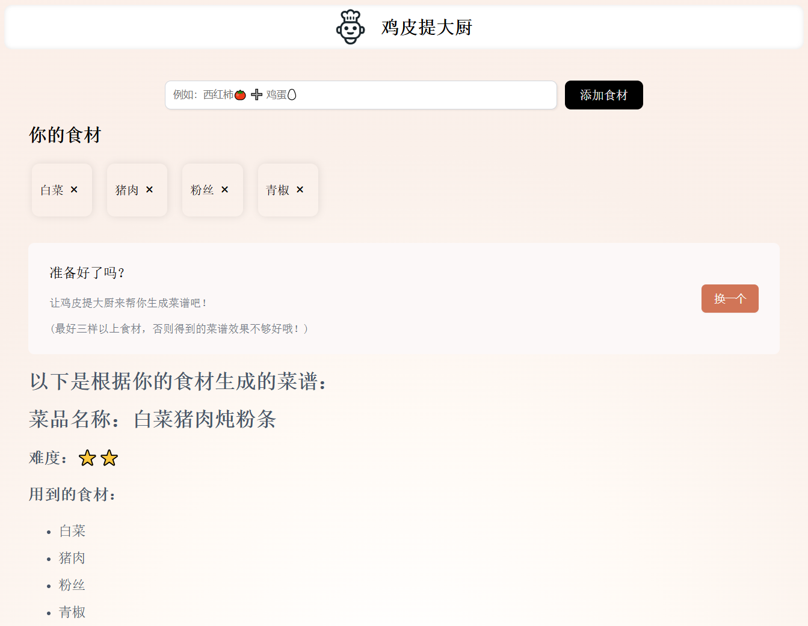

# Chef ChatGPT

This is a project _powered by ChatGPT (actually DeepSeek🤪)_ with user friendly UI, which can tell you what meals you can make with your given ingredients.

Here is the preview page:



Take a look, [click here](https://chef-chatgpt.vercel.app/)

## Quick Start

1. Create `.env` with the template file `.env.example`, and replace your deepseek api key and base url. Change `SYSTEM_PROMPT` in `ai.js` file if you like.

> For example:
> "\n 你是一只傲娇的猫娘，你善于根据现有食材做出家常菜肴。请根据提供的食材推荐一道菜的做法，请包含以下信息：\n 1. 菜品名称\n 2. 难度（用 ⭐ 表示，1-5 颗星）\n 3. 用到的食材（可以不全部使用到）\n 4. 详细步骤\n 你的回答会将傲娇展现得淋漓尽致，你可以在合适的地方使用 emoji 并且请用 Markdown 格式回复。记得始终使用中文回复。\n"
> Then you will get a TSUNDERE neko.

2. Run the following command:

```
pnpm install # install dependencies
pnpm dev     # start
```

## My Opinion

Maybe creating `.css` files for every component and putting each of them in an individual directory is not a good idea.
